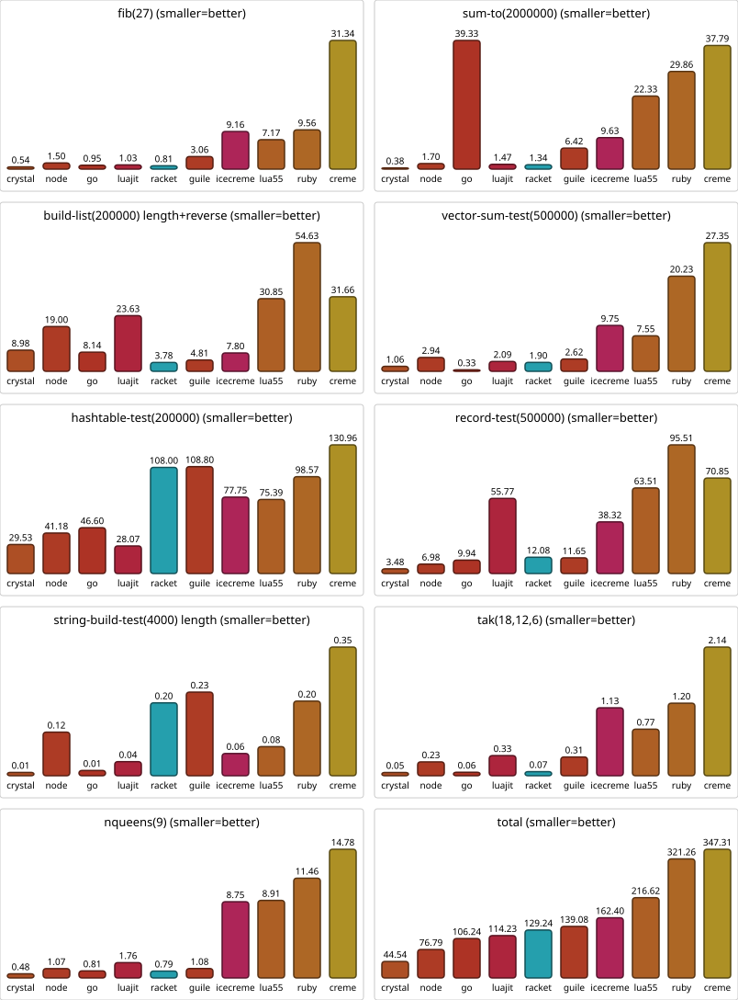
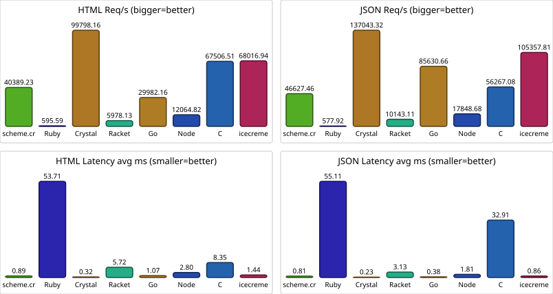

# creme bench

## Environment

- Commit: 42b2438
- Crystal: Crystal 1.20.2 [84f389ac5424] (2026-05-15)
- OS: FreeBSD
- Arch: amd64
- CPU: AMD Ryzen 9 7900X 12-Core Processor
- Cores: 8
- Memory: 15.6 GiB

## Runtime versions

- creme: 0.1.0
- icecreme: creme 0.1.0 (icecreme/self-hosted, FreeBSD/amd64)
- Crystal: Crystal 1.20.2 [84f389ac5424] (2026-05-15) (native comparison floor)
- Go: go version go1.24.13 freebsd/amd64
- Ruby: ruby 3.4.9 (2026-03-11 revision 76cca827ab) +PRISM [amd64-freebsd15]
- Racket: Welcome to Racket v9.2 [cs].
- Guile: guile (GNU Guile) 3.0.11
- Node: v24.18.0
- Lua: Lua 5.5.1  Copyright (C) 1994-2026 Lua.org, PUC-Rio
- LuaJIT: LuaJIT 2.1.1785192264 -- Copyright (C) 2005-2026 Mike Pall. https://luajit.org/

## bench: measurements (milliseconds)

single-threaded — 1 of 8 logical cores

| workload                          | crystal |  node |     go | luajit | racket |  guile | icecreme |  lua55 |   ruby |  creme |
| --------------------------------- | ------- | ----- | ------ | ------ | ------ | ------ | -------- | ------ | ------ | ------ |
| fib(27)                           |    0.54 |  1.50 |   0.95 |   1.03 |   0.81 |   3.06 |     9.16 |   7.17 |   9.56 |  31.34 |
| sum-to(2000000)                   |    0.38 |  1.70 |  39.33 |   1.47 |   1.34 |   6.42 |     9.63 |  22.33 |  29.86 |  37.79 |
| build-list(200000) length+reverse |    8.98 | 19.00 |   8.14 |  23.63 |   3.78 |   4.81 |     7.80 |  30.85 |  54.63 |  31.66 |
| vector-sum-test(500000)           |    1.06 |  2.94 |   0.33 |   2.09 |   1.90 |   2.62 |     9.75 |   7.55 |  20.23 |  27.35 |
| hashtable-test(200000)            |   29.53 | 41.18 |  46.60 |  28.07 | 108.00 | 108.80 |    77.75 |  75.39 |  98.57 | 130.96 |
| record-test(500000)               |    3.48 |  6.98 |   9.94 |  55.77 |  12.08 |  11.65 |    38.32 |  63.51 |  95.51 |  70.85 |
| string-build-test(4000) length    |    0.01 |  0.12 |   0.01 |   0.04 |   0.20 |   0.23 |     0.06 |   0.08 |   0.20 |   0.35 |
| tak(18,12,6)                      |    0.05 |  0.23 |   0.06 |   0.33 |   0.07 |   0.31 |     1.13 |   0.77 |   1.20 |   2.14 |
| nqueens(9)                        |    0.48 |  1.07 |   0.81 |   1.76 |   0.79 |   1.08 |     8.75 |   8.91 |  11.46 |  14.78 |
| total                             |   44.54 | 76.79 | 106.24 | 114.23 | 129.24 | 139.08 |   162.40 | 216.62 | 321.26 | 347.31 |

## bench: comparison matrix

row's total time / column's total time

|          | crystal | node |   go | luajit | racket | guile | icecreme | lua55 | ruby | creme |
| -------- | ------- | ---- | ---- | ------ | ------ | ----- | -------- | ----- | ---- | ----- |
| crystal  |       - | 0.6x | 0.4x |   0.4x |   0.3x |  0.3x |     0.3x |  0.2x | 0.1x |  0.1x |
| node     |    1.7x |    - | 0.7x |   0.7x |   0.6x |  0.6x |     0.5x |  0.4x | 0.2x |  0.2x |
| go       |    2.4x | 1.4x |    - |   0.9x |   0.8x |  0.8x |     0.7x |  0.5x | 0.3x |  0.3x |
| luajit   |    2.6x | 1.5x | 1.1x |      - |   0.9x |  0.8x |     0.7x |  0.5x | 0.4x |  0.3x |
| racket   |    2.9x | 1.7x | 1.2x |   1.1x |      - |  0.9x |     0.8x |  0.6x | 0.4x |  0.4x |
| guile    |    3.1x | 1.8x | 1.3x |   1.2x |   1.1x |     - |     0.9x |  0.6x | 0.4x |  0.4x |
| icecreme |    3.6x | 2.1x | 1.5x |   1.4x |   1.3x |  1.2x |        - |  0.7x | 0.5x |  0.5x |
| lua55    |    4.9x | 2.8x | 2.0x |   1.9x |   1.7x |  1.6x |     1.3x |     - | 0.7x |  0.6x |
| ruby     |    7.2x | 4.2x | 3.0x |   2.8x |   2.5x |  2.3x |     2.0x |  1.5x |    - |  0.9x |
| creme    |    7.8x | 4.5x | 3.3x |   3.0x |   2.7x |  2.5x |     2.1x |  1.6x | 1.1x |     - |
## todo-app: results (req/s)

| App                                  | HTML Req/s | JSON Req/s |
| ------------------------------------ | ---------- | ---------- |
| scheme.cr / bin/creme                |   40389.23 |   46627.46 |
| Ruby / Sinatra+ERB+Sequel+SQLite     |     595.59 |     577.92 |
| Crystal / Kemal+Granite+ECR+SQLite   |   99798.16 |  137043.32 |
| Racket / web-server+db+SQLite        |    5978.13 |   10143.11 |
| Go / Fiber+GORM+html-template+SQLite |   29982.16 |   85630.66 |
| Node / Express+Drizzle+Eta+SQLite    |   12064.82 |   17848.68 |
| C / facil.io+mustache+SQLite3        |   67506.51 |   56267.08 |
| icecreme / creme (C11 prototype VM)  |   68016.94 |  105357.81 |

## todo-app: latency (ms)

| App                                  | Content-Type     |   Avg |    p90 |    p99 |
| ------------------------------------ | ---------------- | ----- | ------ | ------ |
| scheme.cr / bin/creme                | text/html        |  0.89 |   0.78 |   6.14 |
| scheme.cr / bin/creme                | application/json |  0.81 |   0.68 |   6.74 |
| Ruby / Sinatra+ERB+Sequel+SQLite     | text/html        | 53.71 |  69.58 |  88.53 |
| Ruby / Sinatra+ERB+Sequel+SQLite     | application/json | 55.11 |  79.76 | 115.21 |
| Crystal / Kemal+Granite+ECR+SQLite   | text/html        |  0.32 |   0.46 |   0.59 |
| Crystal / Kemal+Granite+ECR+SQLite   | application/json |  0.23 |   0.31 |   0.47 |
| Racket / web-server+db+SQLite        | text/html        |  5.72 |   6.32 |  25.63 |
| Racket / web-server+db+SQLite        | application/json |  3.13 |   3.88 |   4.45 |
| Go / Fiber+GORM+html-template+SQLite | text/html        |  1.07 |   1.80 |   2.24 |
| Go / Fiber+GORM+html-template+SQLite | application/json |  0.38 |   0.65 |   0.92 |
| Node / Express+Drizzle+Eta+SQLite    | text/html        |  2.80 |   2.99 |   4.10 |
| Node / Express+Drizzle+Eta+SQLite    | application/json |  1.81 |   1.97 |   2.28 |
| C / facil.io+mustache+SQLite3        | text/html        |  8.35 |   0.66 | 164.93 |
| C / facil.io+mustache+SQLite3        | application/json | 32.91 | 130.46 | 176.00 |
| icecreme / creme (C11 prototype VM)  | text/html        |  1.44 |   0.85 |  18.97 |
| icecreme / creme (C11 prototype VM)  | application/json |  0.86 |   0.33 |  17.75 |

## todo-app: ranked by HTML throughput

| # | App                                  |    Req/s | vs next |
| --- | ------------------------------------ | -------- | ------- |
| 1 | Crystal / Kemal+Granite+ECR+SQLite   | 99798.16 |    1.5x |
| 2 | icecreme / creme (C11 prototype VM)  | 68016.94 |    1.0x |
| 3 | C / facil.io+mustache+SQLite3        | 67506.51 |    1.7x |
| 4 | scheme.cr / bin/creme                | 40389.23 |    1.3x |
| 5 | Go / Fiber+GORM+html-template+SQLite | 29982.16 |    2.5x |
| 6 | Node / Express+Drizzle+Eta+SQLite    | 12064.82 |    2.0x |
| 7 | Racket / web-server+db+SQLite        |  5978.13 |   10.0x |
| 8 | Ruby / Sinatra+ERB+Sequel+SQLite     |   595.59 |     n/a |

## todo-app: ranked by JSON throughput

| # | App                                  |     Req/s | vs next |
| --- | ------------------------------------ | --------- | ------- |
| 1 | Crystal / Kemal+Granite+ECR+SQLite   | 137043.32 |    1.3x |
| 2 | icecreme / creme (C11 prototype VM)  | 105357.81 |    1.2x |
| 3 | Go / Fiber+GORM+html-template+SQLite |  85630.66 |    1.5x |
| 4 | C / facil.io+mustache+SQLite3        |  56267.08 |    1.2x |
| 5 | scheme.cr / bin/creme                |  46627.46 |    2.6x |
| 6 | Node / Express+Drizzle+Eta+SQLite    |  17848.68 |    1.8x |
| 7 | Racket / web-server+db+SQLite        |  10143.11 |   17.6x |
| 8 | Ruby / Sinatra+ERB+Sequel+SQLite     |    577.92 |     n/a |
